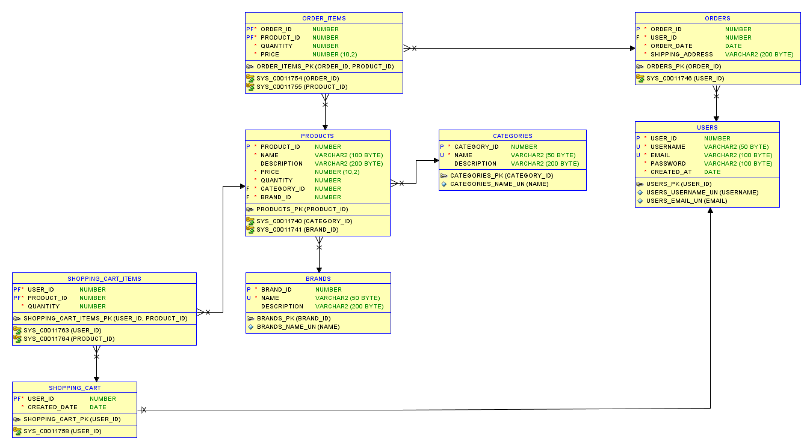

# Shopping Cart

E-Commerce Shopping Platform powered by Flask and Oracle Database

## Table of Contents

- [Overview](#overview)
- [ER Diagram](#er-diagram)
- [Features](#features)
- [Project Structure](#project-structure)
- [Screenshots](#screenshots)
- [Report](#report)
- [How to Run](#how-to-run)

## Overview

This project is a simple e-commerce shopping cart web application built with Flask (Python) and Oracle Database. Users can sign up, log in, browse products, add items to their cart, and place orders. The backend is powered by Oracle SQL procedures and triggers.

## ER Diagram



## Features

- User authentication (Sign Up, Login, Logout)
- Product catalog browsing
- Add to cart, increment/decrement quantity, remove from cart
- Checkout and order placement
- Order history and order details

## Project Structure

```
shopping-cart/
  app.py                # Main Flask application
  shopping_cart.sql     # Oracle SQL schema and procedures
  templates/            # HTML templates (Jinja2)
  images/               # Project images and ER diagram
  Report.pdf            # Project report
  README.md             # Project documentation
```

## Screenshots

- [Cart](images/cart.jpeg)
- [Checkout](images/checkout.jpeg)
- [Login](images/login.jpeg)
- [Order Details](images/order_details.jpeg)
- [Orders](images/orders.jpeg)
- [Products](images/products.jpeg)
- [Sign Up](images/sign_up.jpeg)

## Report

- Please visit the project report for documentation of this project:
- [Project Report (PDF)](Report.pdf)

## Images Folder

- [Browse all images](images/)

## How to Run

1. Install Python and required packages (Flask, oracledb).
2. Set up Oracle Database and run `shopping_cart.sql` to create tables and procedures.
3. Set the `FLASK_SECRET_KEY` environment variable (optional).
4. Run the Flask app:

   ```powershell
   python app.py
   ```

5. Open your browser and go to `http://localhost:5000`.
